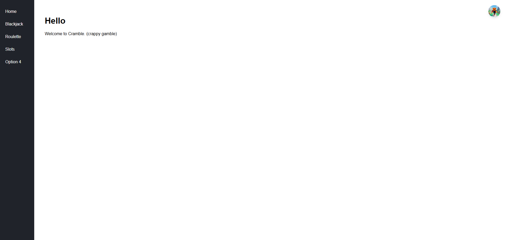
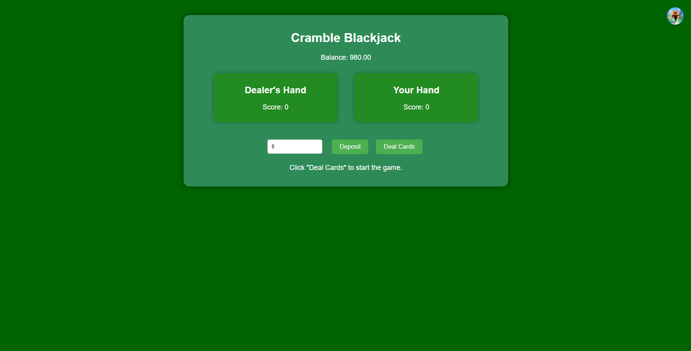
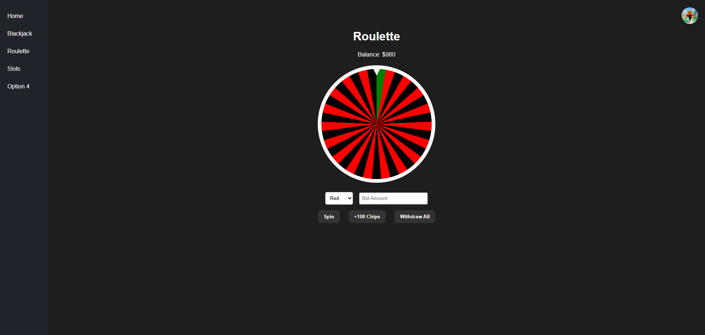
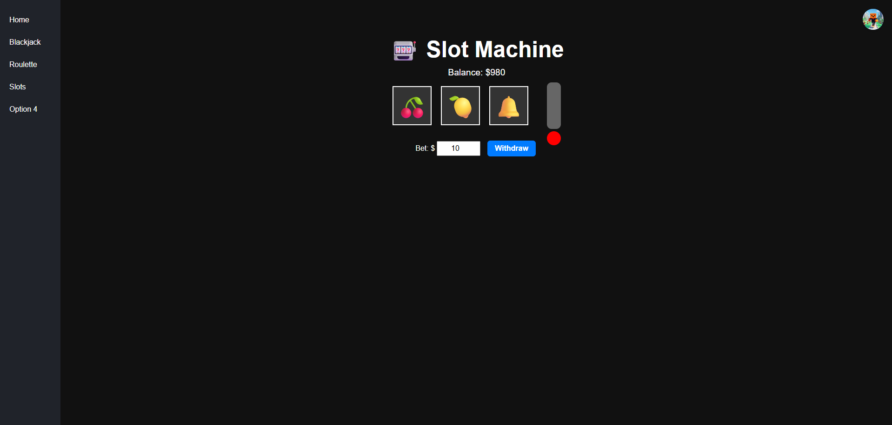

## 🃏 Cramble – Web Game Hub

**Cramble** is a Firebase-powered web app where users can play games like **Blackjack**, **Roulette**, and **Slots** while earning and managing points (tokens). It features user authentication, persistent balances, and a sidebar navigation system.

This site has Github Pages! Play the game [here!](https://detensable.github.io/Cramble/)

If you encounter an error, bug, or anything that needs to be looked at, create an [issue](https://github.com/Detensable/Cramble/issues) with your bug, how to replicate it, and a screenshot/video.
Your bug reports help make the site better! 

---

## 🚀 Features

* 🔐 **Firebase Auth** – Sign up, sign in, and manage sessions
* 💾 **Realtime Database** – Store each user's point balance
* 🎮 **Games**

  * Blackjack 
  * Roulette 
  * Slots
  * Dice
  * Crash
  * AND MORE COMING!!!
* 📂 **Persistent Balance** – Balance is shared across all games
* 👤 **Profile System** – Upload profile image & view profile
* 🧭 **Sidebar Menu** – Quick access to all game pages
* ⚙️ **Responsive Layout** – Clean design with top-right user controls

---

## 🔧 Setup Instructions

1. **Clone the repo or download manually**

2. **Add your Firebase config**

Create a `firebase-config.js` file:

```js
const firebaseConfig = {
  apiKey: "YOUR_API_KEY",
  authDomain: "YOUR_PROJECT_ID.firebaseapp.com",
  databaseURL: "https://YOUR_PROJECT_ID.firebaseio.com",
  projectId: "YOUR_PROJECT_ID",
  storageBucket: "YOUR_PROJECT_ID.appspot.com",
  messagingSenderId: "SENDER_ID",
  appId: "APP_ID"
};

firebase.initializeApp(firebaseConfig);
```

> ⚠️ Make sure to **exclude this file from GitHub** to avoid exposing your keys publicly! (i just dont care so i didnt)

3. **Enable Firebase services**

   * Go to [Firebase Console](https://console.firebase.google.com)
   * Enable **Authentication** (email/password)
   * Enable **Realtime Database**

4. **Open `index.html`** to start the login flow 

---

## ✨ Customization

* 💰 Change default starting points in Firebase `.once("value")` fallback
* 🎲 Add more games by duplicating templates and updating the sidebar
* 🏆 Build a leaderboard by reading all user `points` from the DB

---

## 📸 Screenshots

| Home               | Blackjack        | Roulette               | Slots               |
| ------------------ | ---------------- | ---------------------- | ------------------- |
|  |  |  |  |

---

## 📜 License

MIT – Do whatever you want. Attribution appreciated but not required.

---

